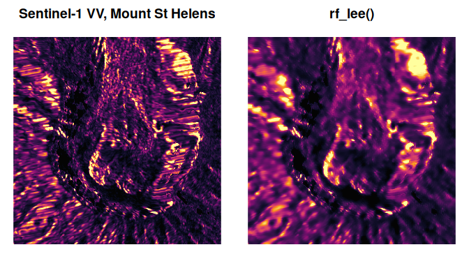
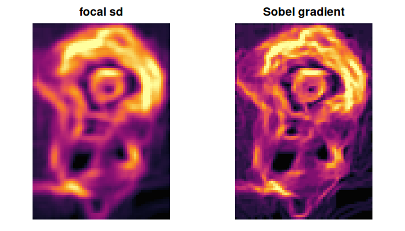

<!-- README.md is generated from README.Rmd. Please edit that file -->

# rustyfilters

<!-- badges: start -->

[](https://github.com/belian-earth/rustyfilters/actions/workflows/R-CMD-check.yaml)
[](https://app.codecov.io/gh/belian-earth/rustyfilters)
[](https://www.apache.org/licenses/LICENSE-2.0)
<!-- badges: end -->

Minimal, blazing-fast moving-window filters for R matrices and 3-D
arrays, with methods for terra `SpatRaster` and gdalraster `GDALRaster`
objects, powered by Rust and rayon.

- **Speckle filters** for SAR intensity data: `rf_lee()`,
  `rf_enhanced_lee()`, `rf_lee_sigma()`, `rf_lee_sigma_improved()` (Lee
  et al. 2009, SNAP-style), `rf_frost()`, `rf_kuan()`, `rf_gamma_map()`.
- **Smoothing**: `rf_mean()` (boxcar), `rf_gaussian()` (separable),
  `rf_median()`, plus the edge-preserving `rf_bilateral()` and
  `rf_guided()` (He et al. 2013, window-size-independent cost).
- **Focal statistics**: `rf_focal()` with min, max, range, sd, sum,
  mode.
- **Convolution and edges**: `rf_convolve()` with arbitrary kernels,
  `rf_sobel()`, `rf_laplacian()`.
- **Parallel by default**: all cores on load; tune with
  `rf_set_threads()`. Results are bitwise identical whatever the thread
  count.
- **NA-aware by default**: missing cells are excluded from every window
  statistic (`na_policy = "omit"`), with a documented fast path
  (`na_policy = "propagate"`) that compiles NA handling out of the inner
  loop entirely: any `NA` in a window then makes that cell `NA`. Choose
  it when your data has no missing values.
- **Four edge policies**: `"shrink"` (default), `"reflect"`,
  `"nearest"`, `"constant"`.

Mean, sum, sd and the single-pass speckle filters (Lee, enhanced Lee,
Kuan, Gamma-MAP) run on a separable sliding-sum engine whose per-cell
cost is independent of the window size, so a 21 x 21 window costs the
same as 3 x 3.

## Installation

``` r
# install.packages("pak")
pak::pak("belian-earth/rustyfilters")
```

Building from source needs a Rust toolchain (rustc \>= 1.80):
<https://rustup.rs>.

## Quick start

The package ships `s1_sthelens`, a real Sentinel-1 backscatter patch
over the crater of Mount St Helens, and `rf_plot()`, a small
percentile-stretch image helper:

``` r
library(rustyfilters)

op <- par(mfrow = c(1, 2), mar = c(1, 1, 2, 1))
rf_plot(s1_sthelens, main = "Sentinel-1 VV, Mount St Helens")
rf_plot(rf_lee(s1_sthelens, window = 7L, looks = 1), main = "rf_lee()")
```



``` r
par(op)
```

Focal statistics, smoothing and convolution share the same engine:

``` r
op <- par(mfrow = c(1, 2), mar = c(1, 1, 2, 1))
rf_plot(rf_focal(volcano, window = 5L, stat = "sd"), main = "focal sd")
rf_plot(rf_sobel(volcano), main = "Sobel gradient")
```



``` r
par(op)
```

### terra and gdalraster

`SpatRaster` methods are available whenever terra is installed (the
raster is materialised in memory, filtered layer by layer, and rebuilt
with its geometry):

``` r
r <- terra::rast(system.file("ex/elev.tif", package = "terra"))
rf_median(r, window = 5L)
#> class       : SpatRaster
#> size        : 90, 95, 1  (nrow, ncol, nlyr)
#> resolution  : 0.008333333, 0.008333333  (x, y)
#> extent      : 5.741667, 6.533333, 49.44167, 50.19167  (xmin, xmax, ymin, ymax)
#> coord. ref. : lon/lat WGS 84 (EPSG:4326)
#> source(s)   : memory
#> name        : elevation
#> min value   :       142
#> max value   :     537.5
```

Open gdalraster `GDALRaster` datasets work the same way: the result is a
new `GDALRaster` object on a Float64 dataset with the source’s geometry,
in-memory (`/vsimem`) by default or on disk via `filename`. Rasters too
large for memory (above `options(rustyfilters.block_memory)`, default 2
GiB) are streamed automatically through row bands with a filter-sized
halo, writing to a GeoTIFF tempfile; interior band seams are exact, and
`by_block`/`block_rows` give manual control:

``` r
f <- system.file("extdata/storml_elev.tif", package = "gdalraster")
ds <- new(gdalraster::GDALRaster, f)
smoothed <- rf_median(ds, window = 5L)
smoothed
#> C++ object of class <GDALRaster>
#> • Driver: GeoTIFF (GTiff)
#> • DSN: "/vsimem/rustyfilters_1478f21aeff804.tif"
#> • Dimensions: 143, 107, 1
#> • CRS: NAD83 / UTM zone 12N (EPSG:26912)
#> • Pixel resolution: 30.000000, 30.000000
#> • Bbox: 323476.071971, 5101871.983031, 327766.071971, 5105081.983031
smoothed$close()
ds$close()
```

### Threads

Everything runs on all cores by default. Control it globally:

``` r
rf_get_threads()
#> [1] 20
old <- rf_set_threads(2L)
rf_set_threads(old)
```

Set `options(rustyfilters.threads = n)` or `RUSTYFILTERS_NUM_THREADS`
before loading to change the startup default.

## Roadmap

- Histogram/van Herk O(1) median, min and max

## Acknowledgements

The build tooling follows the [extendr](https://extendr.github.io/) /
[rextendr](https://extendr.github.io/rextendr/) template.
